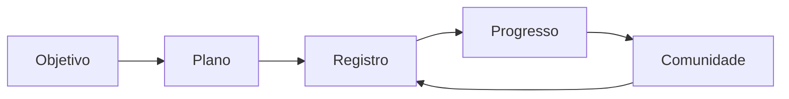

O FitFolio foi pensado para transformar rotina fitness em histórico: você define objetivos, recebe uma base de plano, registra o que executou e acompanha sua evolução ao longo do tempo.

<Steps>
  <Step title="Baixe o app">
    Acesse o app pelo site oficial em [fitfolio.com.br/app](https://fitfolio.com.br/app) e instale a versão disponível para seu dispositivo.
  </Step>
  <Step title="Crie sua conta">
    Use um e-mail válido e complete as etapas de cadastro. Seus dados de conta são usados para manter seu histórico sincronizado.
  </Step>
  <Step title="Responda o onboarding">
    Informe objetivo, rotina, preferências e contexto inicial. Essas respostas ajudam o app a montar uma base de treino e dieta mais útil.
  </Step>
  <Step title="Revise seu plano">
    Confira a sugestão inicial antes de usar no dia a dia. Ajuste o que não fizer sentido para sua realidade.
  </Step>
  <Step title="Registre a execução real">
    Salve treinos, cargas, refeições e progresso. O valor do FitFolio cresce quando o histórico representa o que você realmente fez.
  </Step>
  <Step title="Acompanhe e compartilhe">
    Use progresso, streaks, comunidade e rankings como reforço de consistência.
  </Step>
</Steps>

## O ciclo principal

## Comece simples

Você não precisa preencher tudo no primeiro dia. Uma boa primeira semana é:

- completar o onboarding com calma;
- registrar pelo menos um treino;
- salvar refeições principais;
- acompanhar o calendário de progresso;
- explorar comunidade e clubes sem pressão.

## Quando revisar o plano

Revise treino ou dieta quando sua rotina mudar, quando algum exercício não fizer sentido, quando uma refeição ficar impraticável ou quando seu objetivo mudar. O plano precisa servir sua vida real, não virar uma lista impossível.

<Card title="Depois do começo" icon="list-checks" href="/product-guide/onboarding">
  Entenda melhor o onboarding e como interpretar as primeiras recomendações.
</Card>
